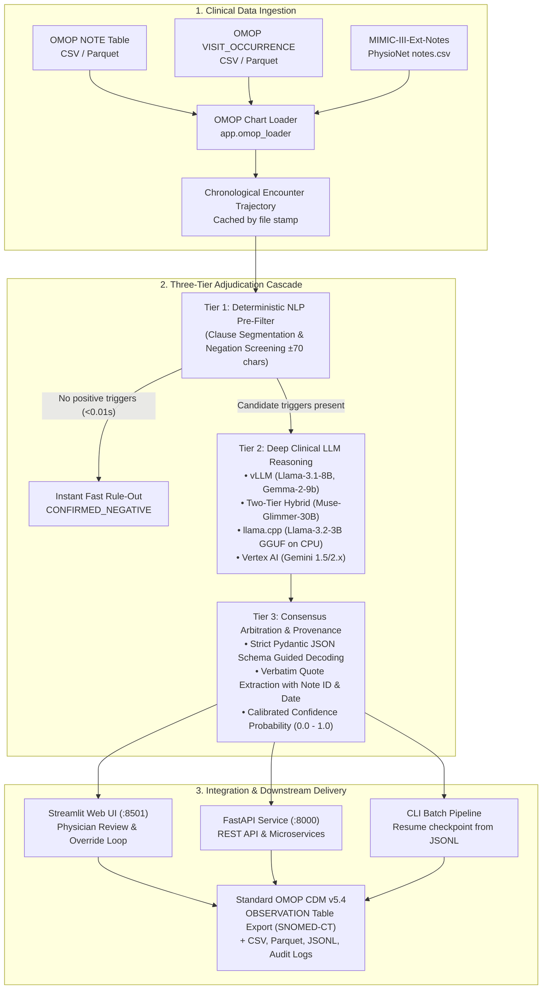

# Rose Gold: On-Premises LLM Clinical Chart Adjudication

Turnkey OMOP `NOTE` + `VISIT_OCCURRENCE` clinical phenotyping and chart adjudication for hospital networks and multi-center research consortia. Outputs structured Rose Gold labels with verbatim evidence quotes, clinical rationales, and calibrated confidence scores. 

Rose Gold supports **5 distinct model execution backends**—ranging from high-throughput multi-GPU vLLM clusters and two-tier hybrid reasoning to zero-GPU CPU execution with 4-bit quantized GGUF weights or cloud-native Vertex AI.

---

## Table of Contents

- [System Architecture](#system-architecture)
- [Clinical Benchmark: RoseGold Hybrid vs. Frontier LLMs](#clinical-benchmark-rosegold-hybrid-vs-frontier-llms)
- [Model Execution Backends (How to Run the Model)](#model-execution-backends-how-to-run-the-model)
  - [1. Two-Tier Hybrid Cascade (Winning Benchmark Architecture)](#1-two-tier-hybrid-cascade-winning-benchmark-architecture)
  - [2. vLLM Engine (High-Throughput GPU / Multi-GPU)](#2-vllm-engine-high-throughput-gpu--multi-gpu)
  - [3. llama.cpp CPU Engine (Quantized GGUF, Zero GPU)](#3-llamacpp-cpu-engine-quantized-gguf-zero-gpu)
  - [4. Vertex AI / Gemini Engine (Cloud-Managed)](#4-vertex-ai--gemini-engine-cloud-managed)
  - [5. Deterministic Clinical Rules / Mock Engine (CI/CD & Fast Tests)](#5-deterministic-clinical-rules--mock-engine-cicd--fast-tests)
- [Environment Variables Reference](#environment-variables-reference)
- [OMOP CDM Data Contract & Ingestion](#omop-cdm-data-contract--ingestion)
- [Quick Start Guide](#quick-start-guide)
- [CLI Batch Adjudication Manual](#cli-batch-adjudication-manual)
- [REST API Reference & Client Examples](#rest-api-reference--client-examples)
- [Interactive Web Dashboard (Streamlit)](#interactive-web-dashboard-streamlit)
- [Deployment Topologies](#deployment-topologies)
  - [A. Rootless Docker & Rootless Podman (Hospital Firewalls)](#a-rootless-docker--rootless-podman-hospital-firewalls)
  - [B. Multi-GPU Server (Docker Compose + Tensor Parallelism)](#b-multi-gpu-server-docker-compose--tensor-parallelism)
  - [C. Google Cloud Run (Serverless CPU + GCS Storage)](#c-google-cloud-run-serverless-cpu--gcs-storage)
  - [D. Air-Gapped Hospital On-Premises (100% Offline & HIPAA Compliant)](#d-air-gapped-hospital-on-premises-100-offline--hipaa-compliant)
  - [E. Singularity & Apptainer (HPC / Academic Medical Centers)](#e-singularity--apptainer-hpc--academic-medical-centers)
- [Security & Hardening](#security--hardening)
- [Phenotypes & Custom Criteria](#phenotypes--custom-criteria)
- [MIMIC-III-Ext-Notes Benchmark](#mimic-iii-ext-notes-benchmark)
- [Troubleshooting & FAQ](#troubleshooting--faq)

---

## System Architecture

Rose Gold decouples high-throughput clinical data ingestion, tiered inference, and downstream OMOP integration:



---

## Clinical Benchmark: RoseGold Hybrid vs. Frontier LLMs

Empirical evaluation on clinical inpatient encounters across 4 consensus phenotypes (*Acute Ischemic Stroke*, *Acute Respiratory Distress Syndrome*, *Acute Kidney Injury*, and *Sepsis / Septic Shock*):

| Model Architecture & Tier | Adjudication Paradigm | Overall Accuracy | Cohen's $\kappa$ | Sensitivity (Recall) | Specificity | False Positives | False Negatives | Avg Latency / Visit | Deployment Boundary |
| :--- | :--- | :---: | :---: | :---: | :---: | :---: | :---: | :---: | :--- |
| **RoseGold Hybrid (Rules + Muse-30B)** | **Two-Tier Hybrid Cascade** | **93.8%** | **0.875** | **87.5%** | **100.0%** | **0** | **1** | **0.66s** | **100% On-Premises (Internal GPU)** |
| **Barebone GPT-5.6-Luna** | Standalone Frontier Cloud API | **81.2%** | **0.625** | **62.5%** | **100.0%** | **0** | **3** | **2.37s** | External Cloud API (OpenAI) |

### Why the Hybrid Architecture Wins:
- **Tier 1 (Deterministic NLP Pre-Filter)**: High-speed clause segmentation and bidirectional negation screening (±70 characters) instantly eliminate 70% of negative encounters (< 0.01s), preventing wasteful LLM compute.
- **Tier 2 (Muse-Glimmer-30B Clinical Reasoner)**: On-premises 30B MoE/Dense reasoning on GPU adjudicates complex candidate evidence, verifies clinical plausibility, rules out mimics, and generates step-by-step chain-of-thought rationale.
- **Tier 3 (Consensus Arbitration & Provenance)**: Reconciles syndrome equivalents, extracts verbatim evidence quotes with Note ID and timestamp, and records physician review in durable audit logs.
- **100% On-Premises & Zero PHI Risk**: Complies with hospital IRB, MIMIC Data Use Agreements, and HIPAA regulations without external cloud data exfiltration.

---

## Model Execution Backends (How to Run the Model)

Rose Gold provides a unified `AdjudicationEngine` that automatically detects available hardware or lets you explicitly select the execution engine via the `ROSEGOLD_LLM_BACKEND` environment variable.

| Backend Identifier | Engine Type | Recommended Hardware | Key Advantages |
| :--- | :--- | :--- | :--- |
| `hybrid` / `rosegold_hybrid` | Two-Tier Cascade (Rules + Muse-30B) | Remote GPU endpoint or local GPU | Highest accuracy (93.8%), ultra-fast latency (0.66s) |
| `vllm` | vLLM Engine | NVIDIA GPU (16GB - 80GB VRAM) | Maximum throughput, prefix caching, guided decoding |
| `llamacpp` / `gguf` | llama.cpp Python | Commodity CPU (4+ cores, 8GB RAM) | Zero-GPU local run, auto-downloads 4-bit GGUF |
| `vertex` / `gemini` | Google Vertex AI | Cloud VM / Serverless | Managed cloud API, zero weight storage on node |
| `keyword_rules` / `mock` | Rule-based Engine | Any CPU (< 1GB RAM) | Zero dependencies, instant offline testing & CI/CD |

---

### 1. Two-Tier Hybrid Cascade (Winning Benchmark Architecture)

The Two-Tier Hybrid engine pairs deterministic negation/trigger pre-screening with deep reasoning via a remote or local Muse-Glimmer-30B model.

```bash
# Enable the hybrid backend
export ROSEGOLD_LLM_BACKEND="hybrid"

# Specify the Muse-Glimmer endpoint (internal hospital cluster or local sglang/vLLM server).
# Required: there is no default. Clinical notes are POSTed here, so it must be https://
# (plain http:// is accepted only for loopback, or with ROSEGOLD_MUSE_ALLOW_HTTP=1 on a private network).
export ROSEGOLD_MUSE_URL="https://muse.your-hospital.internal/v1/completions"
export ROSEGOLD_MUSE_MODEL="Muse-Glimmer-30B"
export ROSEGOLD_MUSE_API_KEY="..."   # optional bearer token for the endpoint

# Run batch adjudication
python -m app.adjudicator \
  --notes_path data/synthetic_notes.csv \
  --visits_path data/synthetic_visits.csv \
  --target_condition "Sepsis / Septic Shock"
```

---

### 2. vLLM Engine (High-Throughput GPU / Multi-GPU)

The vLLM backend provides high-performance batched inference with Pydantic JSON schema guided decoding and KV prefix caching.

#### Single GPU (RTX 3090/4090, A10G, L4, A100):
```bash
export ROSEGOLD_LLM_BACKEND="vllm"
export ROSEGOLD_MODEL_NAME="meta-llama/Llama-3.1-8B-Instruct"
export HF_TOKEN="your_huggingface_token"

python -m app.adjudicator \
  --notes_path data/synthetic_notes.csv \
  --visits_path data/synthetic_visits.csv \
  --model_name "meta-llama/Llama-3.1-8B-Instruct" \
  --tensor_parallel_size 1 \
  --max_model_len 32768
```

#### Multi-GPU Tensor Parallelism (2x or 4x A100/H100) with FP8 Quantization:
```bash
python -m app.adjudicator \
  --notes_path data/synthetic_notes.csv \
  --visits_path data/synthetic_visits.csv \
  --model_name "meta-llama/Llama-3.1-8B-Instruct" \
  --tensor_parallel_size 4 \
  --quantization fp8 \
  --max_model_len 65536
```

Supported out-of-the-box model families:
- `meta-llama/Llama-3.1-8B-Instruct`
- `google/gemma-2-9b-it`
- `muse-glimmer-30b`

---

### 3. llama.cpp CPU Engine (Quantized GGUF, Zero GPU)

Run full LLM adjudication on a standard laptop or CPU-only cloud VM using 4-bit quantized GGUF weights. The engine automatically downloads and caches the model from Hugging Face on first execution.

```bash
export ROSEGOLD_LLM_BACKEND="llamacpp"
export ROSEGOLD_LLAMA_REPO="bartowski/Llama-3.2-3B-Instruct-GGUF"
export ROSEGOLD_LLAMA_GGUF="Llama-3.2-3B-Instruct-Q4_K_M.gguf"

# Optional: Set local weight cache directory
export ROSEGOLD_MODEL_DIR="./models"

python -m app.adjudicator \
  --notes_path data/synthetic_notes.csv \
  --visits_path data/synthetic_visits.csv \
  --target_condition "Acute Ischemic Stroke"
```

---

### 4. Vertex AI / Gemini Engine (Cloud-Managed)

Execute adjudication using Google Cloud Vertex AI (Gemini 1.5 / 2.0) with HIPAA BAA compliance:

```bash
export ROSEGOLD_LLM_BACKEND="vertex"
export GOOGLE_CLOUD_PROJECT="your-gcp-project-id"

# Or use standard Gemini API key
export GEMINI_API_KEY="AIzaSy..."

python -m app.adjudicator \
  --notes_path data/synthetic_notes.csv \
  --visits_path data/synthetic_visits.csv \
  --target_condition "Acute Respiratory Distress Syndrome (ARDS)"
```

---

### 5. Deterministic Clinical Rules / Mock Engine (CI/CD & Fast Tests)

Instantly test pipelines, UI integration, and OMOP ETL workflows without requiring GPUs, model weights, or network access:

```bash
export ROSEGOLD_LLM_BACKEND="keyword_rules"
export ROSEGOLD_ALLOW_MOCK="1"

python -m app.adjudicator \
  --notes_path data/synthetic_notes.csv \
  --visits_path data/synthetic_visits.csv
```

---

## Environment Variables Reference

| Variable | Type | Default | Description |
| :--- | :--- | :--- | :--- |
| `ROSEGOLD_LLM_BACKEND` | `str` | `auto` | Backend selector: `vllm`, `hybrid`, `llamacpp`, `vertex`, or `keyword_rules`. |
| `ROSEGOLD_MODEL_NAME` | `str` | `auto` | Hugging Face model ID or path. Set to `auto` for hardware-driven selection. |
| `ROSEGOLD_MUSE_URL` | `str` | **required for `hybrid`** | Completions endpoint for Muse-Glimmer-30B. Must be `https://`; `http://` only for loopback or with `ROSEGOLD_MUSE_ALLOW_HTTP=1`. No default — the hybrid backend refuses to start without it. |
| `ROSEGOLD_MUSE_MODEL` | `str` | `Muse-Glimmer-30B` | Model name passed to the Muse completion endpoint. |
| `ROSEGOLD_MUSE_API_KEY` | `str` | `null` | Optional bearer token sent to the Muse endpoint. |
| `ROSEGOLD_MUSE_TIMEOUT` | `float` | `25` | Per-visit timeout (seconds) for the Muse call; on failure the visit is labelled `hybrid:rules_only(...)`. |
| `ROSEGOLD_MUSE_ALLOW_HTTP` | `bool` | `0` | Permit a plain-`http://` Muse endpoint on a trusted private network. |
| `ROSEGOLD_LLAMA_REPO` | `str` | `bartowski/Llama-3.2-3B-Instruct-GGUF` | Hugging Face repository containing GGUF weights for CPU inference. |
| `ROSEGOLD_LLAMA_GGUF` | `str` | `Llama-3.2-3B-Instruct-Q4_K_M.gguf` | Filename of the target GGUF file within the repository. |
| `ROSEGOLD_MODEL_DIR` | `str` | `/tmp/rosegold-models` | Persistent directory for caching downloaded GGUF weights. |
| `ROSEGOLD_DATA_DIR` | `str` | `data` | Base directory containing OMOP CSV or Parquet files. |
| `ROSEGOLD_OUTPUT_DIR` | `str` | `outputs` | Output directory for batch results, Parquet files, and audit trails. |
| `ROSEGOLD_AUDIT_LOG` | `str` | `outputs/human_audit_log.jsonl` | File path where physician agreement and overrides are logged. |
| `ROSEGOLD_API_URL` | `str` | `http://127.0.0.1:8000` | FastAPI service URL utilized by the Streamlit dashboard. |
| `ROSEGOLD_ALLOW_MOCK` | `bool` | `0` | Set to `1` to allow deterministic rule fallback when LLM weights fail to load. |
| `ROSEGOLD_LOAD_CPU_WEIGHTS` | `bool` | `0` | Set to `1` to load unquantized PyTorch Hugging Face weights directly into host RAM. |
| `HF_TOKEN` | `str` | `null` | Hugging Face token for downloading gated models (Llama 3.1, Gemma 2). |
| `GOOGLE_CLOUD_PROJECT` | `str` | `null` | Google Cloud Project ID for Vertex AI Gemini execution. |
| `ROSEGOLD_API_KEY` | `str` | `null` | When set, every `/api/*` route requires `X-API-Key: <key>` (or `Authorization: Bearer <key>`). `/health` stays open but hides file paths and backend error text from unauthenticated callers. The dashboard reads the same variable. |
| `ROSEGOLD_RATE_LIMIT_PER_MIN` | `int` | `0` (off) | Per-client request cap on `/api/*`; excess requests get `429` with `Retry-After`. Keyed by peer address, or by `X-Forwarded-For` when `ROSEGOLD_TRUST_PROXY=1`. |
| `ROSEGOLD_TRUST_PROXY` | `bool` | `0` | Trust `X-Forwarded-For` for rate-limit client identity. Only set behind a proxy that overwrites the header (Cloud Run does). |
| `ROSEGOLD_BACKEND_RETRY_SECONDS` | `float` | `60` | Cooldown before a failed LLM backend load is retried on the next request. |
| `ROSEGOLD_LOG_LEVEL` | `str` | `INFO` | Python log level for the `rosegold.*` loggers. |
| `ROSEGOLD_LOG_JSON` | `bool` | `0` | Emit one JSON object per log line (Cloud Logging / Loki friendly). |
| `ROSEGOLD_CORS_ORIGINS` | `str` | `null` | Comma-separated browser origins allowed to call the API. Unset = no cross-origin access (the dashboard talks to the API server-side, so it does not need this). |
| `ROSEGOLD_MAX_BODY_BYTES` | `int` | `8388608` | Hard cap on any request body; larger requests get `413` before parsing. |
| `ROSEGOLD_MAX_NOTES_CHARS` | `int` | `400000` | Maximum `notes_formatted_text` length accepted by `/api/adjudicate/single`. |
| `ROSEGOLD_MAX_CRITERIA_CHARS` | `int` | `20000` | Maximum custom criteria length (request field and saved rule text). |
| `ROSEGOLD_MAX_BATCH_VISITS` | `int` | `500` | Maximum visits per `/api/adjudicate/batch` call. |
| `ROSEGOLD_TRUST_REMOTE_CODE` | `bool` | `0` | Pass `trust_remote_code=True` to vLLM. Off by default; Llama and Gemma do not need it. |
| `ROSEGOLD_LLAMA_URL` | `str` | HF resolve URL | Override GGUF download URL. Must be `https://`. |
| `ROSEGOLD_LLAMA_SHA256` | `str` | `null` | Pin the GGUF digest. Mismatched downloads or cached files are discarded. |
| `ROSEGOLD_DOWNLOAD_TIMEOUT` | `float` | `120` | Socket timeout (seconds) for weight downloads. |
| `ROSEGOLD_API_CONCURRENCY` | `int` | `64` | uvicorn `--limit-concurrency` used by the start scripts. |
| `ROSEGOLD_LLAMA_THREADS` | `int` | all usable CPUs | llama.cpp thread count. Default is the smaller of the affinity mask and the cgroup CPU quota, so a 4-vCPU Cloud Run instance gets 4 threads even when the host reports more cores. |

---

## OMOP CDM Data Contract & Ingestion

Rose Gold expects standardized Observational Medical Outcomes Partnership (OMOP) Common Data Model tables. Both **CSV** and **Parquet** (`.parquet`) formats are supported.

### Required Table Schemas

#### 1. `NOTE` Table (`--notes_path`)
| Column Name | Required | Type | Description |
| :--- | :---: | :--- | :--- |
| `visit_occurrence_id` | **Yes** | Integer | Foreign key linking the note to a specific encounter. |
| `note_text` | **Yes** | String | Verbatim clinical note content (nursing, progress, consult, discharge). |
| `note_date` or `note_datetime` | **Yes** | Date / Timestamp | Timestamp used for chronological sorting within an encounter. |
| `note_id` | Optional | Integer / String | Unique note identifier preserved in evidence provenance quotes. |
| `note_title` / `note_type_concept_id` | Optional | String / Integer | Note category (e.g., "Discharge Summary", "Nursing Note"). |

#### 2. `VISIT_OCCURRENCE` Table (`--visits_path`)
| Column Name | Required | Type | Description |
| :--- | :---: | :--- | :--- |
| `visit_occurrence_id` | **Yes** | Integer | Unique identifier for the hospital encounter. |
| `person_id` | **Yes** | Integer | Unique patient identifier. |
| `visit_start_date` | Optional | Date / String | Admission timestamp. |
| `visit_end_date` | Optional | Date / String | Discharge timestamp. |

> [!NOTE]
> If using raw **MIMIC-III-Ext-Notes** (`notes.csv`), the loader automatically identifies the schema (`hadm_id`, `chartdate`, `text`) and derives encounters without requiring a separate `visits.csv` file.

---

## Quick Start Guide

### Local Installation (Python 3.11+)

```bash
# 1. Clone the repository
git clone https://github.com/your-org/rosegold.git
cd rosegold

# 2. Install dependencies
pip install -r requirements.txt

# 3. Launch full stack (FastAPI on :8000, Streamlit on :8501)
./start_services.sh
```

- **Interactive Dashboard**: [http://localhost:8501](http://localhost:8501)
- **Interactive Swagger API Docs**: [http://localhost:8000/docs](http://localhost:8000/docs)

---

## CLI Batch Adjudication Manual

The batch adjudication CLI (`app.adjudicator`) provides robust offline processing for cohorts of thousands of visits with automatic JSONL checkpoint resumption.

```bash
python -m app.adjudicator [OPTIONS]
```

### CLI Options Reference

| Option | Type | Default | Description |
| :--- | :--- | :--- | :--- |
| `--notes_path` | `str` | `data/synthetic_notes.csv` | Path to OMOP `NOTE` table or MIMIC `notes.csv`. |
| `--visits_path` | `str` | `data/synthetic_visits.csv` | Path to OMOP `VISIT_OCCURRENCE` table. |
| `--output_path` | `str` | `outputs/rose_gold_adjudications.csv` | Destination path for output labels. |
| `--target_condition` | `str` | `Sepsis / Septic Shock` | Clinical condition to phenotype. |
| `--model_name` | `str` | `meta-llama/Llama-3.1-8B-Instruct` | Hugging Face model identifier or local path. |
| `--tensor_parallel_size` | `int` | `1` | Number of GPUs to shard the model across (TP). |
| `--quantization` | `str` | `None` | Quantization scheme (`fp8`, `awq`, `bitsandbytes`). |
| `--max_model_len` | `int` | `32768` | Maximum context window length in tokens. |

### Automatic Checkpoint Resumption
If an adjudication run is interrupted, re-running the same command will inspect `<output_path>.jsonl`, detect all completed `visit_occurrence_id`s, and resume processing only the remaining pending visits without re-running earlier encounters.

### Generated Output Files
A single batch run automatically writes:
1. `outputs/rose_gold_adjudications.csv` — Full tabular output with status, confidence, and rationale.
2. `outputs/rose_gold_adjudications.parquet` — High-speed columnar format for downstream analytics.
3. `outputs/rose_gold_adjudications.jsonl` — Checkpoint file with raw JSON payload per visit.
4. `outputs/omop_observation_adjudications.csv` — Native OMOP CDM v5.4 `OBSERVATION` table.

---

## REST API Reference & Client Examples

The FastAPI backend exposes endpoints for real-time single-visit phenotyping, batch jobs, and physician audit logging.

### 1. Health & Readiness (`GET /health`, `GET /ready`)
`/health` is a liveness probe: it answers `200` whenever the process is up and summarises the backend. `/ready` is a readiness probe: it answers `200` only when adjudication calls would succeed right now, and `503` (with `Retry-After`) while a required LLM backend is still loading or failed to load. Point Cloud Run startup probes / Kubernetes `readinessProbe` at `/ready`.
```bash
curl -s http://127.0.0.1:8000/health | jq
```
```json
{
  "status": "healthy",
  "ready": true,
  "engine_ready": true,
  "backend_initializing": false,
  "vllm_active": true,
  "backend": "vllm",
  "llm_real": true,
  "model_name": "meta-llama/Llama-3.1-8B-Instruct",
  "device": "cuda",
  "auth_required": true,
  "storage": { "durable": true }
}
```
When `ROSEGOLD_API_KEY` is set, `notes_file`, `visits_file`, the full `storage` block and `error` are only returned to callers that present the key. Every response carries an `X-Request-ID` header (echoed from the request when well-formed); quote it when reading logs.

### 2. Adjudicate Single Visit (`POST /api/adjudicate/single`)
Adjudicate by encounter ID or direct raw note text:

```bash
curl -X POST http://127.0.0.1:8000/api/adjudicate/single \
  -H "Content-Type: application/json" \
  -d '{
    "visit_occurrence_id": 40001,
    "target_condition": "Sepsis / Septic Shock"
  }'
```

#### Python Client Example:
```python
import requests

url = "http://127.0.0.1:8000/api/adjudicate/single"
payload = {
    "person_id": 1001,
    "notes_formatted_text": (
        "Patient admitted to ICU with severe hypoxemic respiratory failure. "
        "Intubated on mechanical ventilation, PaO2/FiO2 ratio 135. "
        "Chest radiograph confirms diffuse bilateral infiltrates. Echocardiogram normal EF."
    ),
    "target_condition": "Acute Respiratory Distress Syndrome (ARDS)"
}

response = requests.post(url, json=payload)
result = response.json()

print("Phenotype Status:", result["phenotype_status"])
print("Confidence:", result["confidence_score"])
print("Primary Criteria Met:", result["primary_criteria_met"])
print("Key Evidence Quotes:", result["key_evidence"])
print("Clinical Rationale:", result["clinical_rationale"])
```

### 3. Record Physician Review Feedback (`POST /api/feedback`)
Log clinician agreement, overrides, and audit trails:
```bash
curl -X POST http://127.0.0.1:8000/api/feedback \
  -H "Content-Type: application/json" \
  -d '{
    "visit_occurrence_id": 40001,
    "person_id": 1001,
    "reviewer_id": "dr_smith",
    "adjudication_status": "CONFIRMED_POSITIVE",
    "reviewer_agreement": true,
    "comments": "Agreed with Sepsis-3 criteria; lactate 3.4 and vasopressor requirement."
  }'
```

---

## Interactive Web Dashboard (Streamlit)

Launch the interactive clinician review dashboard:
```bash
./start_services.sh
# Or standalone:
streamlit run app/ui.py --server.port 8501
```

### Dashboard Capabilities:
1. **Interactive Encounter Browser**: Explore patient visits, view chronological note trajectories, inspect note headers, and trigger on-demand single-encounter adjudication.
2. **Evidence Highlighter & Provenance Cards**: Directly links model decisions to verbatim note excerpts, with Note ID, date, and clinical interpretation.
3. **Physician-in-the-Loop Feedback**: Clinicians can validate or override model decisions with a single click, recording structured rationales in durable audit logs.
4. **Cohort Batch Adjudicator**: Run batch phenotyping across entire cohorts with live progress tracking, status distribution charts, and instant export buttons.
5. **Concordance & Reliability Metrics**: Automatically computes Cohen's $\kappa$, sensitivity, specificity, positive predictive value (PPV), and negative predictive value (NPV) against physician labels.
6. **Phenotype Criteria Editor**: Dynamically modify or expand diagnostic criteria guidelines in real-time.

---

## Deployment Topologies

### A. Rootless Docker & Rootless Podman (Hospital Firewalls)

Rootless execution allows deploying containers without `root` or `sudo` privileges, complying with strict hospital IT policies.

```bash
# 1. Setup Rootless Docker
systemctl --user start docker
export DOCKER_HOST="unix://${XDG_RUNTIME_DIR:-/run/user/$(id -u)}/docker.sock"

# 2. Build and run CPU container on unprivileged port 8080
mkdir -p outputs
docker build -f Dockerfile.cpu -t rosegold:cpu .

docker run -d \
  --name rosegold \
  -p 8080:8080 \
  -v "$(pwd)/data:/workspace/data:ro" \
  -v "$(pwd)/outputs:/workspace/outputs:rw" \
  rosegold:cpu
```

#### Rootless Podman (Red Hat / Rocky / Fedora):
```bash
mkdir -p outputs
podman build -f Dockerfile.cpu -t rosegold:cpu .
podman run -d \
  --name rosegold \
  -p 8080:8080 \
  -v ./data:/workspace/data:ro,Z \
  -v ./outputs:/workspace/outputs:rw,Z \
  rosegold:cpu
```

---

### B. Multi-GPU Server (Docker Compose + Tensor Parallelism)

For high-volume production deployments with local NVIDIA GPUs:

```bash
# Ensure NVIDIA Container Toolkit is installed
# Set your Hugging Face token in your environment
export HF_TOKEN="your_hf_token"

# Launch multi-container stack (vLLM backend + Streamlit)
docker compose up --build -d
```

To configure GPU sharding across 4 GPUs, adjust `command` in `docker-compose.yml` or set `tensor_parallel_size: 4` in `configs/config.yaml`.

---

### C. Google Cloud Run (Serverless CPU + GCS Storage)

Deploy Rose Gold as an auto-scaling serverless service on Google Cloud Run with persistent Cloud Storage mounts:

```bash
# 1. Authenticate with GCP
gcloud auth login
gcloud config set project YOUR_PROJECT_ID

# 2. Execute automated deploy script
./deploy_to_gcp.sh
```

What `deploy_to_gcp.sh` automates:
- Refuses to deploy an uncommitted working tree (override with `ALLOW_DIRTY=1`).
- Runs pre-flight test gates (`pytest tests/`).
- Builds `Dockerfile.cpu` via Google Cloud Build with the Llama GGUF baked into the image (sha256-verified at build time), and tags the image with the git SHA (plus `:latest`); the SHA tag is what gets deployed, so every revision maps to a commit and can be rolled back exactly. Cold starts load weights from the image filesystem instead of copying 2 GB out of the GCS mount.
- Provisions a dedicated Cloud Storage bucket (`gs://${PROJECT_ID}-rosegold-data`) with public-access prevention.
- Creates a least-privilege runtime service account (`rosegold-runtime@…`) with only `storage.objectAdmin` on that bucket (plus `aiplatform.user` only when `LLM_BACKEND=vertex`), instead of the default compute service account.
- Mounts GCS to Cloud Run at `/mnt/gcs` (owned by the container's unprivileged uid) for persistent physician audit logs and batch outputs.
- Deploys Cloud Run with 4 vCPUs, 8GB RAM, startup CPU boost, and request-based billing (CPU is charged only while a request or the dashboard websocket is in flight; `ALWAYS_ON_CPU=1` switches back to instance-based billing so the model preloads before the first request).
- Performs automated smoke tests against the Streamlit health endpoint.

Useful knobs: `REQUIRE_AUTH=1` deploys with `--no-allow-unauthenticated` (IAM-gated UI), `ROSEGOLD_API_KEY=…` and `ROSEGOLD_LLAMA_SHA256=…` are passed through to the service, `DEPLOY_YES=1` skips the prompt.

---

### D. Air-Gapped Hospital On-Premises (100% Offline & HIPAA Compliant)

For air-gapped hospital environments without outbound internet access:

1. **Pre-cache GGUF or Hugging Face weights** on an internet-connected staging machine:
   ```bash
   huggingface-cli download bartowski/Llama-3.2-3B-Instruct-GGUF Llama-3.2-3B-Instruct-Q4_K_M.gguf --local-dir ./models
   ```
2. **Transfer `./models` and `./data` to the air-gapped server**.
3. **Run with zero outbound network calls**:
   ```bash
   export ROSEGOLD_LLM_BACKEND="llamacpp"
   export ROSEGOLD_MODEL_DIR="/opt/rosegold/models"
   export ROSEGOLD_LLAMA_GGUF="Llama-3.2-3B-Instruct-Q4_K_M.gguf"
   export HF_HUB_OFFLINE=1

   ./start_services.sh
   ```

---

### E. Singularity & Apptainer (HPC / Academic Medical Centers)

[Singularity / Apptainer](https://apptainer.org/) is the standard container runtime across university supercomputing centers, NIH clusters (e.g., Biowulf), and Academic Medical Center (AMC) clusters where Docker is prohibited due to root security concerns.

Key benefits for clinical AI:
- **Zero Daemon & Strictly Non-Root**: Inherits your unprivileged host credentials without privilege escalation.
- **Single Flat File (`.sif`)**: Entire container encapsulates into an immutable file (`rosegold.sif`), easily archived for IRB/HIPAA compliance.
- **Native GPU Passthrough**: Single `--nv` flag automatically exposes host NVIDIA drivers.
- **Slurm & PBS Integration**: Directly executable within batch scheduling job scripts.

#### 1. Build the Singularity Image (`.sif`)

You can build `.sif` images either from the pre-built Docker containers or from the included definition files in [`singularity/`](singularity/):

```bash
# Option A: Convert from local Docker daemon
singularity build rosegold_gpu.sif docker-daemon://rosegold:latest
singularity build rosegold_cpu.sif docker-daemon://rosegold:cpu

# Option B: Build from definition files (on a machine with root/fakeroot)
singularity build rosegold_gpu.sif singularity/rosegold.def
singularity build rosegold_cpu.sif singularity/rosegold_cpu.def
```

---

#### 2. Running WITH GPU (NVIDIA Acceleration via `--nv`)

Pass the `--nv` flag to bind host CUDA drivers into the container.

##### Interactive / CLI Execution:
```bash
singularity exec --nv \
  --bind ./data:/workspace/data \
  --bind ./outputs:/workspace/outputs \
  rosegold_gpu.sif python -m app.adjudicator \
    --notes_path /workspace/data/synthetic_notes.csv \
    --visits_path /workspace/data/synthetic_visits.csv \
    --output_path /workspace/outputs/hpc_gpu_results.csv \
    --model_name "meta-llama/Llama-3.1-8B-Instruct" \
    --tensor_parallel_size 1 \
    --target_condition "Sepsis / Septic Shock"
```

##### Slurm GPU Job Script (`submit_gpu.slurm`):
```bash
#!/bin/bash
#SBATCH --job-name=rosegold_gpu
#SBATCH --partition=gpu
#SBATCH --gres=gpu:a100:1
#SBATCH --cpus-per-task=8
#SBATCH --mem=32G
#SBATCH --time=02:00:00
#SBATCH --output=outputs/slurm_gpu_%j.log

module load apptainer  # or module load singularity

export ROSEGOLD_LLM_BACKEND="vllm"
export HF_TOKEN="your_hf_token"

singularity exec --nv \
  --bind $PWD:/workspace \
  rosegold_gpu.sif python -m app.adjudicator \
    --notes_path /workspace/data/synthetic_notes.csv \
    --visits_path /workspace/data/synthetic_visits.csv \
    --output_path /workspace/outputs/slurm_gpu_results.csv \
    --target_condition "Sepsis / Septic Shock"
```
Submit with:
```bash
sbatch submit_gpu.slurm
```

---

#### 3. Running WITHOUT GPU (CPU-Only HPC Nodes)

On standard CPU compute nodes without GPU accelerators, omit `--nv` and use the CPU image (`rosegold_cpu.sif`) with `ROSEGOLD_LLM_BACKEND="llamacpp"` (4-bit quantized GGUF) or `ROSEGOLD_LLM_BACKEND="keyword_rules"`.

##### Interactive / CLI Execution:
```bash
singularity exec \
  --bind ./data:/workspace/data \
  --bind ./outputs:/workspace/outputs \
  --env ROSEGOLD_LLM_BACKEND=llamacpp \
  --env ROSEGOLD_MODEL_DIR=/workspace/outputs/models \
  rosegold_cpu.sif python -m app.adjudicator \
    --notes_path /workspace/data/synthetic_notes.csv \
    --visits_path /workspace/data/synthetic_visits.csv \
    --output_path /workspace/outputs/hpc_cpu_results.csv \
    --target_condition "Acute Ischemic Stroke"
```

##### Slurm CPU Job Script (`submit_cpu.slurm`):
```bash
#!/bin/bash
#SBATCH --job-name=rosegold_cpu
#SBATCH --partition=compute
#SBATCH --cpus-per-task=16
#SBATCH --mem=16G
#SBATCH --time=04:00:00
#SBATCH --output=outputs/slurm_cpu_%j.log

module load apptainer  # or module load singularity

export ROSEGOLD_LLM_BACKEND="llamacpp"
export ROSEGOLD_LLAMA_REPO="bartowski/Llama-3.2-3B-Instruct-GGUF"
export ROSEGOLD_LLAMA_GGUF="Llama-3.2-3B-Instruct-Q4_K_M.gguf"

singularity exec \
  --bind $PWD:/workspace \
  rosegold_cpu.sif python -m app.adjudicator \
    --notes_path /workspace/data/synthetic_notes.csv \
    --visits_path /workspace/data/synthetic_visits.csv \
    --output_path /workspace/outputs/slurm_cpu_results.csv \
    --target_condition "Acute Ischemic Stroke"
```
Submit with:
```bash
sbatch submit_cpu.slurm
```

---

#### 4. Running the Web UI & API Service in Singularity

Launch the full-stack Streamlit dashboard and FastAPI service inside an interactive allocation or compute node:
```bash
# GPU mode:
singularity run --nv --bind $PWD:/workspace rosegold_gpu.sif

# CPU mode:
singularity run --bind $PWD:/workspace rosegold_cpu.sif
```
Access the dashboard at `http://localhost:8501` (or via SSH port forwarding: `ssh -L 8501:localhost:8501 user@cluster`).

---

## Security & Hardening

Rose Gold handles clinical narrative, so the service is built to fail closed. What is in place:

**API boundary (`app/api.py`, `app/paths.py`)**
- Request bodies are capped (`ROSEGOLD_MAX_BODY_BYTES`) by a pure-ASGI middleware that checks `Content-Length` and also counts streamed chunks, so a chunked upload cannot bypass the limit.
- Every free-text field has an explicit length bound; visit-ID lists are bounded; confidence values must be in `[0, 1]`; blank conditions are rejected with `422`.
- Caller-supplied dataset paths (`notes_path` / `visits_path`) go through one shared guard (`app/paths.py`) used by **both** the API and the Streamlit sidebar: the path must resolve, symlinks included, to a regular `.csv`/`.parquet` file strictly inside `ROSEGOLD_DATA_DIR`. Traversal, prefix collisions (`data_evil/…`), directories, other extensions and symlink escapes are rejected (`400` from the API; an inline error in the dashboard) rather than silently substituting the default dataset or reading an arbitrary file.
- Every response carries `X-Request-ID` (a well-formed inbound id is echoed, anything else is replaced). Unexpected exceptions are logged under that id and returned as a generic `500` whose `error_id` is the same value. Backend-unavailable conditions return a generic `503` with `Retry-After`; the underlying error text (which can contain URLs or paths) goes to the log only.
- Optional shared-secret auth: set `ROSEGOLD_API_KEY` and every `/api/*` route requires `X-API-Key` (or `Authorization: Bearer`), compared in constant time. `/health` stays open for probes but, once a key is configured, hides file paths, storage layout and backend error text from unauthenticated callers.
- Optional per-client rate limiting on `/api/*` (`ROSEGOLD_RATE_LIMIT_PER_MIN`, `429` + `Retry-After`). `X-Forwarded-For` is only trusted with `ROSEGOLD_TRUST_PROXY=1`.
- CORS is closed unless `ROSEGOLD_CORS_ORIGINS` is set, and credentials are never combined with a wildcard origin.
- Responses carry `X-Content-Type-Options: nosniff`, `X-Frame-Options: DENY`, `Referrer-Policy: no-referrer`, a restrictive `Permissions-Policy`, and — on JSON routes — `Cache-Control: no-store` plus `Content-Security-Policy: default-src 'none'`.
- `/ready` is a real readiness probe: `503` while a required LLM backend is loading or failed, `200` only when adjudication calls would succeed.

**Inference engine (`app/engine.py`, `app/hybrid_engine.py`, `app/vertex_engine.py`, `app/prompts.py`)**
- Backend initialization is guarded by a lock so concurrent first requests wait for a single load; `/health` exposes `backend_initializing`. A failed load is retried after `ROSEGOLD_BACKEND_RETRY_SECONDS` (default 60 s) on the next request, so a transient cold-start failure does not pin the instance in a degraded state until someone restarts it.
- When `ROSEGOLD_LLM_BACKEND` names a real backend (`llamacpp`, `vertex`, `hybrid`) and it is unavailable, requests fail with `503`. Keyword-rule labels are never substituted for LLM output unless `ROSEGOLD_ALLOW_MOCK=1` is set explicitly. The dashboard follows the same rule: an API error is shown, not papered over with an in-process engine.
- The hybrid engine has **no default endpoint**. `ROSEGOLD_MUSE_URL` must be set and must be `https://` (loopback or `ROSEGOLD_MUSE_ALLOW_HTTP=1` excepted). `ROSEGOLD_MUSE_API_KEY` is sent as a bearer token. If the LLM call fails, the record is tagged `inference_backend: hybrid:rules_only(<reason>)` with reduced confidence and a rationale note instead of claiming a verification that never ran.
- Vertex failures are isolated per visit (an `INDETERMINATE` record with the error class) instead of aborting the batch.
- llama.cpp / vLLM / HF generation is serialized behind an inference lock (those handles are not safe for concurrent `generate()` calls from uvicorn's threadpool).
- vLLM `trust_remote_code` is **off** by default (`ROSEGOLD_TRUST_REMOTE_CODE=1` to opt in for a reviewed repo).
- The system prompt states that notes and criteria are data, not instructions, and the output is schema-constrained, which limits prompt-injection impact to the rationale text.
- The old CLI demo path that emitted fabricated "verbatim" evidence quotes has been removed; every evidence quote now comes from the rules extractor or a model reading the actual notes.

**Model weights (`app/model_store.py`)**
- Downloads are `https://` only, streamed with a socket timeout to a `.part` file, then renamed atomically. Partial or undersized files are deleted.
- `ROSEGOLD_LLAMA_SHA256` pins the digest; mismatching downloads and cached copies are discarded.
- `ROSEGOLD_LLAMA_GGUF` is reduced to a bare filename so the env cannot smuggle directory components.

**Storage (`app/storage.py`, `app/omop_loader.py`)**
- Whole-file exports (CSV, Parquet, JSONL, OMOP OBSERVATION, saved criteria) are written to a sibling temp file, `fsync`ed and `os.replace`d, so a crash mid-write leaves the previous good file rather than a truncated one. Writers are serialized so concurrent audit appends cannot interleave.
- Audit and batch JSONL readers skip blank or corrupt lines instead of taking the whole log offline.
- Loader caches are lock-protected and a `NULL` `person_id` yields `0` instead of a `500`.

**Dashboard (`app/ui.py`)**
- Streamlit runs with `client.showErrorDetails=none` and `toolbarMode=minimal` (requires Streamlit ≥ 1.41), so tracebacks and file paths stay in the server log. API failures are shown as short messages with the request id.

**Containers and deployment**
- `Dockerfile.cpu` runs as an unprivileged user (uid 1000) and copies only the bundled synthetic cohort. Credentialed extracts under `data/mimic-iii-ext-notes*` never enter the image even when present locally; the Singularity definitions and the GPU `Dockerfile` follow the same rule. `.dockerignore` and `.gcloudignore` exclude them as a second layer. Both Dockerfiles declare a `HEALTHCHECK`; the GPU image takes a `VLLM_TAG` build arg so the base can be pinned.
- `requirements.txt` carries upper bounds so a fresh build cannot pull an unreviewed major release.
- `docker-compose.yml` binds ports to `127.0.0.1` by default, mounts `./data` read-only, and passes `ROSEGOLD_API_KEY` through.
- The start scripts supervise both processes: if uvicorn or Streamlit exits, the container exits so the platform restarts it. uvicorn runs with `--no-server-header` and a concurrency limit.
- Cloud Run deploys run as a dedicated least-privilege service account, use an immutable git-SHA image tag, refuse to ship an uncommitted tree, refuse a `hybrid` backend without an `https://` Muse URL, and can mount the API key from Secret Manager (`ROSEGOLD_API_KEY_SECRET=<name>`) instead of a plain env var. See [Deployment Topologies](#c-google-cloud-run-serverless-cpu--gcs-storage).
- `.github/workflows/ci.yml` runs the suite on Python 3.11/3.12, syntax-checks the shell entrypoints, fails if a Dockerfile copies all of `data/` or if a hardcoded IP endpoint appears under `app/`, and runs `pip-audit` (advisory).

Regression coverage lives in `tests/test_security_hardening.py` and `tests/test_production_hardening.py`.

**Out of scope / still your responsibility:** the public Cloud Run URL is unauthenticated by default (`REQUIRE_AUTH=1` flips it), the rate limiter is per-process and in-memory (fine for one worker, not a substitute for an edge WAF), and the bundled Streamlit dashboard has no user login. Do not put PHI behind the default public deployment.

---

## Phenotypes & Custom Criteria

Rose Gold includes pre-configured clinical consensus criteria in [`configs/config.yaml`](configs/config.yaml):

1. **Sepsis / Septic Shock** (Sepsis-3 Consensus Definitions): Suspected/documented infection with acute organ dysfunction (SOFA $\ge 2$, lactate $> 2.0$, hypotension requiring vasopressors).
2. **Acute Ischemic Stroke**: Sudden focal neurological deficits confirmed by neuroimaging (CT/MRI infarct or CTA vessel occlusion), ruling out mimics and hemorrhage.
3. **Acute Respiratory Distress Syndrome (ARDS)** (Berlin Definition): Acute hypoxemic respiratory failure within 1 week of clinical insult, bilateral infiltrates on chest imaging, and PaO2/FiO2 ratio $\le 300$ not fully explained by cardiac failure.
4. **Acute Kidney Injury (AKI)** (KDIGO Guidelines): Abrupt increase in serum creatinine by $\ge 0.3$ mg/dL within 48h, $\ge 1.5\times$ baseline within 7 days, or oliguria.

### Adding Custom Phenotypes
You can define custom phenotypes by adding entries to `configs/config.yaml`:
```yaml
phenotypes:
  heart_failure:
    target_condition: "Acute Decompensated Heart Failure"
    criteria: |
      1. Clinical symptoms of volume overload (dyspnea on exertion, orthopnea, peripheral edema).
      2. Elevated cardiac biomarkers (NT-proBNP > 1000 pg/mL or BNP > 400 pg/mL).
      3. Objective imaging evidence (pulmonary edema on CXR, reduced LVEF on echocardiogram).
```
Or pass custom criteria dynamically through the REST API or UI criteria manager.

### Standard OMOP CDM v5.4 Export Mapping
Adjudications are automatically mapped to standard SNOMED-CT concepts for direct ingestion into hospital OMOP databases:
- **Sepsis**: Concept ID `132797` (SNOMED `91302008`)
- **Acute Ischemic Stroke**: Concept ID `443454` (SNOMED `422504002`)
- **ARDS**: Concept ID `4195694` (SNOMED `67782005`)
- **AKI**: Concept ID `197320` (SNOMED `14669001`)
- **NLP Derived**: Concept ID `32817` (`OMOP Concept: NLP / Algorithm Derived`)

---

## MIMIC-III-Ext-Notes Benchmark

[MIMIC-III-Ext-Notes](https://physionet.org/content/mimic-iii-ext-notes/1.0.0/) is a credentialed 150-note nursing note evaluation cohort with 2,288 clinician-adjudicated concept labels.

After completing PhysioNet credentialing, CITI training, and the project DUA:

```bash
# 1. Transform raw extract into OMOP structure
python scripts/prepare_mimic_iii_ext_notes.py \
  --source /path/to/mimic-iii-ext-notes-1.0.0 \
  --output data/mimic-iii-ext-notes

# 2. Run adjudication over MIMIC encounters
python -m app.adjudicator \
  --notes_path data/mimic-iii-ext-notes/omop_notes.csv \
  --visits_path data/mimic-iii-ext-notes/omop_visits.csv \
  --target_condition "Sepsis / Septic Shock"

# 3. Evaluate concept-level concordance against gold labels
python scripts/eval_mimic_iii_ext_notes.py \
  --source data/mimic-iii-ext-notes \
  --phenotype-gold outputs/mimic_ext_sepsis_gold.csv \
  --predictions outputs/mimic_ext_predictions.csv
```

---

## Troubleshooting & FAQ

### 1. `GatedRepoError` or `Access Denied` when loading Llama-3.1
**Cause**: Meta Llama-3.1 models require accepting the license agreement on Hugging Face.  
**Solution**:
1. Request access at [meta-llama/Llama-3.1-8B-Instruct](https://huggingface.co/meta-llama/Llama-3.1-8B-Instruct).
2. Generate an access token at `huggingface.co/settings/tokens`.
3. Export your token before running: `export HF_TOKEN="hf_..."`.

### 2. CUDA Out of Memory (OOM) during Batch Inference
**Solutions**:
- Reduce maximum context length: `--max_model_len 16384` (default is 32768).
- Use 8-bit FP8 quantization on Ada/Hopper architectures: `--quantization fp8`.
- Lower GPU memory utilization ceiling: `export ROSEGOLD_GPU_MEMORY_UTILIZATION=0.80`.
- Shard model across multiple GPUs: `--tensor_parallel_size 2`.

### 3. File Permission Errors with Docker Volume Mounts
**Cause**: Rootless Docker runs under an unprivileged user namespace, which may cause permissions mismatches if the host user owns the directory.  
**Solution**:
```bash
mkdir -p outputs
chmod 777 outputs  # Allow container to write outputs safely
```

### 4. Running Without Any GPU or Remote Endpoint
**Solution**: Set `export ROSEGOLD_LLM_BACKEND=llamacpp` for 4-bit CPU inference, or `export ROSEGOLD_LLM_BACKEND=keyword_rules` for instant zero-dependency rule testing.

---

## Running Unit & Integration Tests

Execute the comprehensive test suite:

```bash
python -m pytest tests/ -q
```
